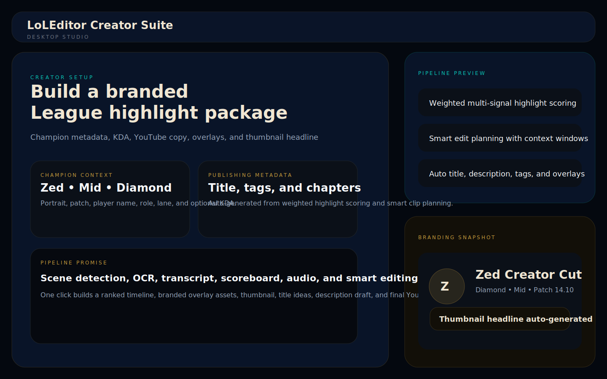
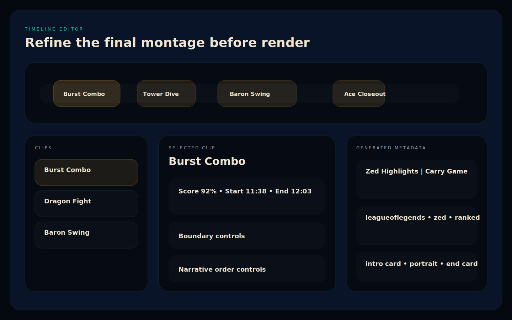

# LoLEditor

AI-powered League of Legends highlight generation for creators.

LoLEditor now combines:

- weighted highlight detection across scene changes, OCR cues, transcript callouts, objective moments, scoreboard swings, combat intensity, and audio spikes
- smart clip planning with pre-fight context, post-fight aftermath, dynamic clip length, and narrative-friendly timeline editing
- champion-aware branding with intro cards, end cards, champion portraits, optional KDA overlays, and thumbnail headlines
- auto-generated YouTube metadata including title ideas, description draft, tags, and chapter markers
- an Electron + React desktop UI backed by a Python/FastAPI processing service

## Screenshots

Desktop setup flow:



Timeline editor:



## What It Does

LoLEditor takes an OBS recording and turns it into a creator-ready highlight package:

1. Imports the recording into a persistent project workspace.
2. Detects highlight candidates using multiple signals.
3. Ranks moments by weighted importance.
4. Builds a smart edit plan with context-aware clip windows.
5. Generates title candidates, description text, tags, and chapters.
6. Prepares overlay assets.
7. Renders a YouTube-ready highlight montage and thumbnail.
8. Optionally uploads the result to YouTube.

## Chosen Desktop Architecture

This repository uses:

- Python backend for analysis, ffmpeg orchestration, rendering, metadata generation, and upload
- FastAPI for the desktop API layer
- Electron + React for the desktop UI

Why this stack:

- the heavy work is already Python- and ffmpeg-centric
- React is a better fit for a timeline-driven editor than Qt for this project
- Electron lets the app keep native file dialogs and drag-and-drop while preserving web UI iteration speed
- it avoids adding Rust/Tauri complexity while the product surface is still evolving quickly

## Current Architecture

Core product layers:

- [`src/league_video_editor/application`](src/league_video_editor/application)
  Application services for persistent projects, analysis orchestration, metadata generation, overlay preparation, and render packaging.
- [`src/league_video_editor/core`](src/league_video_editor/core)
  Multi-signal highlight detection, audio analysis, smart editing, and parallel processing helpers.
- [`src/league_video_editor/rendering`](src/league_video_editor/rendering)
  Overlay asset generation and transition helpers.
- [`src/league_video_editor/server`](src/league_video_editor/server)
  FastAPI backend for the desktop app.
- [`ui`](ui)
  Electron shell and React desktop frontend.
- [`config/example-project.json`](config/example-project.json)
  Example project configuration for branding, detection, editing, and publishing.

Legacy but still supported layers:

- CLI entrypoint in [`src/league_video_editor/cli.py`](src/league_video_editor/cli.py)
- legacy analysis/rendering primitives in [`src/league_video_editor/analyze.py`](src/league_video_editor/analyze.py), [`src/league_video_editor/render.py`](src/league_video_editor/render.py), and [`src/league_video_editor/ffmpeg_utils.py`](src/league_video_editor/ffmpeg_utils.py)

## Detection Model

The desktop product pipeline now scores highlights across:

- scene changes
- kill-feed style OCR cues
- combat intensity from motion + saturation
- objective cues like dragon, baron, towers, inhibitor, nexus
- scoreboard swings from OCR/transcript score patterns
- Whisper transcript callouts
- audio excitement spikes

These signals are combined with configurable weights and then passed into the smart editor.

## Smart Editing

The edit planner supports:

- pre-fight context windows
- post-fight aftermath
- dynamic clip length by intensity
- death context retention
- clip merging and smoothing
- manual timeline deletion, extension, and reordering in the desktop UI

## Publishing Automation

The desktop pipeline generates:

- title candidates
- description draft
- tag list
- chapter markers
- thumbnail headline
- intro card
- end card
- champion portrait manifest
- optional KDA overlay asset

## Installation

### Python

```bash
python3 -m pip install -e ".[ui,upload,dev]"
```

Required local tools:

- `ffmpeg`
- `ffprobe`
- `Pillow` is installed through Python dependencies

Optional local tools:

- `whisper.cpp` / `whisper-cli` for transcript enrichment
- `tesseract` for OCR cue extraction

macOS example:

```bash
brew install ffmpeg tesseract
```

### UI

```bash
cd ui
npm install
```

## Running The Desktop App

Start the backend only:

```bash
lol-video-editor serve
```

Run the React + Electron UI in development:

```bash
cd ui
npm run electron:dev
```

The Electron shell will launch the Python API automatically in development.

## Running The CLI

Legacy CLI commands still work:

```bash
lol-video-editor auto /path/to/recording.mp4 \
  --output highlights.mp4 \
  --plan edit-plan.json
```

Useful CLI helpers:

- `lol-video-editor analyze`
- `lol-video-editor render`
- `lol-video-editor thumbnail`
- `lol-video-editor description`
- `lol-video-editor upload`
- `lol-video-editor serve`

## Example Project Config

Use the example project config as a baseline:

- [`config/example-project.json`](config/example-project.json)

It includes:

- champion metadata
- optional KDA
- signal weight tuning
- editing defaults
- overlay settings
- output profile
- generated content defaults
- upload defaults

## Updated Repository Shape

```text
LoLEditor/
├── config/
│   └── example-project.json
├── docs/
│   └── screenshots/
├── src/league_video_editor/
│   ├── application/
│   │   ├── analysis.py
│   │   ├── content.py
│   │   ├── overlays.py
│   │   ├── production.py
│   │   └── project_store.py
│   ├── config/
│   ├── core/
│   ├── rendering/
│   ├── server/
│   └── upload.py
└── ui/
    ├── electron/
    └── src/
```

## Performance Notes

Current improvements:

- parallel transcript/OCR/audio enrichment
- hardware-aware encoder selection
- persistent desktop project workspaces
- reusable overlay assets
- modular render packaging

Good next optimizations:

- promote the CLI cache store into the desktop server pipeline
- chunked parallel frame analysis for long games
- GPU-assisted OCR/transcript preprocessing where available
- render artifact reuse for metadata-only revisions

## Future Roadmap

High-priority next steps:

- batch processing for multiple matches
- Shorts / TikTok / vertical export presets
- Twitch clip packaging
- Discord auto-posting hooks
- durable job queues instead of in-process tasks
- richer overlay compositing directly inside the main ffmpeg graph
- stronger region-aware OCR for scoreboard and kill feed
- project templates for recurring creator branding

## Development Notes

The legacy CLI test suite still passes:

```bash
python3 -m pytest -q
```

Python syntax smoke-check:

```bash
python3 -m compileall -q src
```

## What Changed In This Evolution

This repository started as a mostly CLI-first highlight script. It now has:

- a persistent project model
- a real desktop product workflow
- a multi-signal weighted highlight engine wired into the app
- publishing metadata generation
- branded overlay asset generation
- render packaging for final deliverables
- a significantly more polished Electron + React creator UI
